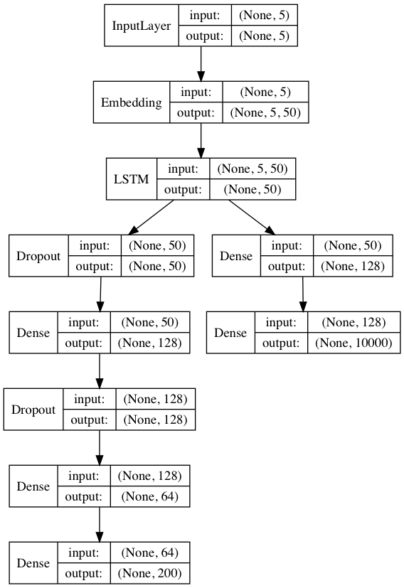
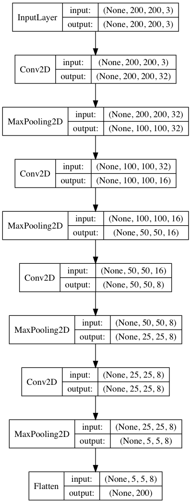

# LT2316 H18 Assignment 3

Git project for implementing assignment 3 in [Asad Sayeed's](https://asayeed.github.io) machine learning class in the University of Gothenburg's Masters
of Language Technology programme.

## Group members

[Stefan Eng](https://github.com/stefaneng)

## How to Run

Run in a jupyter notebook so you can see the image predictions
```python
import prediction

ps = prediction.PredictiveSearch("./models/assign3.model.hdf5", "./data/tokenizer10000.pickle", "./data/enc_images.csv.tar.gz")
ps.predictive_search("A zebra")
```

Will output:
  1. The top-5 most likely next word along with probabilities from the model.
    - Out of vocabulary words are printed out as well
  2. A prediction representing an encoding of the 3 most likely images to go along with the text.

I added more parameters to the provided class.

Class `PredictiveSearch(modelfile, tokenizerfile, encoded_images)`, where
  - `modelfile` is the path to the main model file
  - `tokenizerfile` is the path to the tokenizer used to preprocess the captions for training.
  - `encoded_images` is the path to a `.tar.gz` csv file with the first column as the index of the image and the remaining columns are the autoencoders representation of the image. This can be recreated by running the [write_id_vector.py](./write_id_vector.py) script.

## Training
See [train.py](./train.py)
  - I trained the model on batches of 1000 random caption training examples with 500 epochs.

Running
```
python train.py
```  
will repeat how I trained the model.

## Models

### Main Model
This is the main architecture of the network is shown below.
It is a variation of the network used for assignment 2.
Dropout of 0.2 is used for all the dropout layers and the LSTM layer (dropout and recurrent dropout).
Then LSTM layer branches into the predictions for the vectors and for the word prediction.
The word prediction branch is similar to the assignment 2 network but with a dense layer with _relu_ activation and 128 nodes.
The final prediction is a softmax activation over the 10000 vocabulary words. The loss for this output is categorical cross-entropy.

The vector prediction branch is a deeper network with two layers of dropout.
There are two dense layers with _relu_ activation and 128 and 64 nodes.
Without the dropout and additional layers my network was predicting the same vector no matter what the input was.
It still makes predictions that are very similar.
The final layer is linear (200 nodes) with a mean squared error loss function.




### Encoder
This is the partial model extracted from the autoencoder (code available [here](https://github.com/stefaneng/coco-image-autoencoder)).
It is used to encode each image into a 200 dimensional vector.


